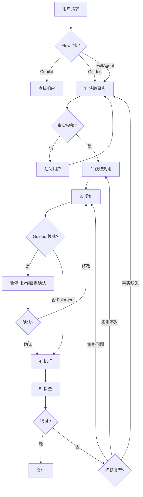

# YunPat-Ai 设计文档

> **项目定位**：面向专利代理人和专利律师的 macOS 桌面端 AI 智能体。先构建通用 base agent，专利垂直能力通过插件渐进叠加。

## 参考架构

- **Osaurus** (`osaurus-main`)：纯 Swift/SwiftUI macOS AI harness，Agent Loop + MLX 本地推理 + 插件系统 + MCP + 沙箱 VM + 隐私过滤器
- **Agent!** (`Agent-main`)：macOS 桌面自主代理，18 个 LLM 提供商 + AXorcist 桌面自动化 + Xcode 集成 + 文件回滚 + 多标签 UI
- **vmlx-swift**：Apple MLX 推理引擎的 Swift 封装

## 关键决策汇总

| 决策点 | 结论 |
|--------|------|
| 参考策略 | 方案 2：胖底座 + Osaurus 架构为主 + Agent! 桌面自动化 |
| 模型策略 | 先 API 聚合（OpenAI/Anthropic/DeepSeek/GLM），架构预留 oMLX 本地推理 |
| 交互深度 | 以桌面自主代理为主，编程场景走沙箱 VM |
| Agent Loop | Flow 模式（Copilot/Guided/FullAgent）+ PatentLoop 五步 + Plan Mode |
| 人机协作 | 五步内嵌协作注入点，挂起等待，无超时 |
| 工具调度 | Capability→Tool 二级分层，LLM 选能力再选工具 |
| 工作目录 | 默认 + 自定义（用户打开文件夹指定） |
| 记忆系统 | 五层（会话→案件→归档→全局→知识库），用户手动决定是否蒸馏保存 |
| 插件模式 | 绝大多数纯工具（无 UI），少数带 UI 面板，MCP 桥接 |
| 内嵌浏览器 | 底座内置，非插件 |
| 网络权限 | 细分为 `networkAPI`（域名白名单）和 `networkArbitrary` |
| 知识库 | 读取已有 Karpathy LLM Wiki（宝宸知识库），不新建不迁移，双消费者模式 |
| 技能系统 | Markdown 定义的轻量 AI 能力单元，可自建可导入，内置 skill 端口构建时注入 |

---

## 技术栈

- **语言**：Swift 6
- **UI 框架**：SwiftUI + AppKit 混合
- **平台**：
  - macOS 15.5+ → 完整功能 - 沙箱 VM
  - macOS 26+  → 全功能（含 Apple Containerization + FoundationModels）
- **本地推理**：MLX（通过 vmlx-swift），初期占位
- **沙箱**：Apple Containerization（macOS 26+ 可用）
- **版本管理**：Git（语义化）+ TimeMachine 快照（双轨保险）
- **数据存储**：SQLite + 可选 SQLCipher + FileVault
- **凭证**：macOS Keychain + Secure Enclave
- **构建**：Xcode 16+，SPM 包管理

---

## 1. 整体架构

```
┌─────────────────────────────────────────────────────────────────────┐
│                         YunPat-Ai.app                                │
│                         (SwiftUI + AppKit)                           │
├─────────────────────────────────────────────────────────────────────┤
│  ┌─────────────┐  ┌─────────────┐  ┌─────────────────────────────┐  │
│  │ 多标签       │  │ Agent       │  │ 文档工作区 + 分屏            │  │
│  │ Chat UI     │  │ Manager     │  │ 编辑器 + 标注感知            │  │
│  └──────┬──────┘  └──────┬──────┘  └──────────────┬──────────────┘  │
│         └────────────────┼────────────────────────┘                 │
|                   │ Agent Loop  │  Flow 模式引擎                      │
|                   │ Engine      │  Copilot / Guided / FullAgent       │
|                   └──────┬──────┘                                    │
|  ┌───────────────────────┼──────────────────────────────────────┐   │
|  │            Capability Registry → Tool Registry                │   │
|  │            二级能力调度                                         │   │
|  ├───────────────────────┴──────────────────────────────────────┤   │
│  │  ┌──────────────┐  ┌──────────────┐  ┌────────────────────┐  │   │
│  │  │ 桌面自动化    │  │ Shell 执行   │  │ 沙箱 VM           │  │   │
│  │  │ AXorcist     │  │ + 文件系统   │  │ (Containerized)   │  │   │
│  │  └──────────────┘  └──────────────┘  └────────────────────┘  │   │
│  ├──────────────────────────────────────────────────────────────┤   │
│  │                    MCP Client / Server                        │   │
│  ├──────────────────────────────────────────────────────────────┤   │
│  │  ┌──────────┐  ┌──────────┐  ┌──────────┐  ┌──────────────┐ │   │
│  │  │ OpenAI   │  │Anthropic │  │ DeepSeek │  │ oMLX Adapter │ │   │
│  │  │ API      │  │ API      │  │ API      │  │ (本地推理)   │ │   │
│  │  └──────────┘  └──────────┘  └──────────┘  └──────────────┘ │   │
│  └──────────────────────────────────────────────────────────────┘   │
│  ┌──────────────────────────────────────────────────────────────┐   │
│  │              插件层 → 专利工具按需挂载                         │   │
│  │  专利检索 │ 权利要求撰写 │ OA 分析 │ 对比分析 │ 翻译 │ ...   │   │
│  └──────────────────────────────────────────────────────────────┘   │
└─────────────────────────────────────────────────────────────────────┘
```

### 文件系统规划

```
YunPat-Ai/
├── App/                    # macOS app target
│   ├── YunPatApp.swift     # @main 入口
│   ├── Views/              # 多标签 Chat UI、设置面板、文档工作区
│   └── Assets/             # 图标、资源
├── Packages/
│   ├── YunPatCore/         # Agent Loop Engine、模型协议、工具路由、记忆系统
│   ├── YunPatDesktop/      # 桌面自动化 (AXorcist)、Shell、文件回滚
│   ├── YunPatSandbox/      # Containerization VM 沙箱
│   ├── YunPatPlugins/      # 插件框架 + 内置工具
│   └── YunPatNetworking/   # API 网关 (OpenAI/Anthropic/DeepSeek/GLM)
└── Plugins/                # 用户安装的专利垂直插件
```

### 用户数据目录

```
~/.yunpat/
├── memory/
│   ├── cases/
│   │   ├── {case-id}.sqlite       ← 每个案件独立数据库
│   │   └── index.sqlite           ← 跨案件索引
│   ├── preferences.sqlite         ← 用户偏好
│   ├── templates/                 ← 用户保存的模板
│   └── archive/
├── models/                        ← oMLX 本地模型
├── plugins/                       ← 用户安装的插件
└── skills/                        ← 用户技能 + 导入技能
```

```
~/YunPat/workspaces/
├── tab-001/                       ← 默认工作目录（每个标签自动创建）
│   ├── input/
│   ├── output/
│   └── .yunpat/
│       ├── snapshots/             ← 文件回滚快照
│       ├── history.json
│       └── agent.memory
└── tab-002/
    └── ...
```

---

## 2. Agent Loop Engine

### Flow 模式（替代硬分叉判定）

不再用关键词匹配决定 PatentLoop/AgentLoop。改为三级介入深度：

```
用户请求 → 轻量 LLM 分类 + 标签设置覆盖
              │
    ┌─────────┼─────────┐
    ▼         ▼         ▼
  Copilot   Guided    FullAgent
  (直接响应) (部分Loop) (完整五步)
```

```swift
enum AgentFlow {
    case copilot       // 直接响应，不进入 Loop
    case guided        // PatentLoop 只走到 Step 2 或 Step 3，暂停确认
    case fullAgent     // 完整五步
}

// 判定逻辑：轻量 LLM 分类（非关键词匹配）+ 用户可覆盖
// Tab 设置中增加 loopPreference：.auto / .forcePatent / .forceGeneral
```

| Flow | 适用场景 | 行为 |
|------|----------|------|
| Copilot | 术语解释、格式调整、简单查询 | 直接回答，不进 Loop |
| Guided | 检索、分析、初步撰写 | PatentLoop 1-3 步暂停确认 |
| FullAgent | 完整撰写、OA 答复、无效宣告 | 完整五步，最小人机交互 |

### AgentLoop（通用模式）

```
推理 → 执行 → 验证 → 迭代
  │      │      │      │
  │   Capability  │  结果不符 → 回到推理
  │               │
  └── 完成 ← done()
```

### PatentLoop（专利模式）

```
Step 1: 获取事实
  → FactExtractor：文档解析 + LLM 语义提取 → StructuredFacts
  → 事实不完整 → 追问用户，不进入 Step 2

Step 2: 获取规则
  → RuleRetriever：法条/审查指南/判例检索 → ApplicableRules
  → 本地知识库 + 联网检索

Step 3: 规划（支持 Plan Mode）
  → PatentPlanner：权利要求布局 / 答复策略树 / 检索策略
  → 每个 PlanStep 绑定到 Step 2 中的规则项
  → PlanMode.auto：直接生成 plan → 执行
  → PlanMode.interactive：只读探索 → 生成草案 → 用户确认/修改 → 执行
  → PlanMode.readOnly：只读探索 → 生成草案 → 仅呈现，不执行

Step 4: 执行（内嵌 AgentLoop）
  → 对 plan.steps 逐个执行推理→执行→验证→迭代
  → 复用通用 AgentLoop 引擎

Step 5: 检查（Evaluation Engine）
  → PatentReviewer：规则化自动检查，非一次性 LLM 评估
  → 检查维度：
    • 法条引用：是否引用正确法条号、审查指南章节
    • 事实完整性：是否遗漏 StructuredFacts 中的必要事实
    • 规则一致性：是否与知识库存在冲突（利用 ⟷一致/分歧 标记）
    • 质量门禁：是否达到用户配置的通过标准
  → pass → 交付
  → fail → 标注问题 + 引用证据，回 Step 1/2/3 修正
```

### 循环拓扑



### 代码结构

```swift
protocol LoopEngine {
    func run(request: UserRequest, flow: AgentFlow) async throws -> LoopResult
}

final class AgentLoopEngine: LoopEngine {
    func run(request: UserRequest, flow: AgentFlow) async throws -> LoopResult {
        // 推理 → 调用能力 → 验证 → 迭代，直到 done()
    }
}

final class PatentLoopEngine: LoopEngine {
    let innerLoop: AgentLoopEngine
    
    func run(request: UserRequest, flow: AgentFlow) async throws -> LoopResult {
        let facts = try await step1_extractFacts(request)
        guard facts.missingInfo.isEmpty else { return .needsClarification(facts.missingInfo) }
        let rules = try await step2_retrieveRules(facts)
        let plan  = try await step3_buildPlan(facts, rules, planMode: tab.planMode)
        let finalPlan: UserPlan
        if flow == .guided {
            guard case .approved(let approvedPlan) = await userApproval(plan) else {
                return .cancelled
            }
            finalPlan = approvedPlan
        } else {
            finalPlan = plan  // FullAgent 直接使用原始 plan
        }
        let exec  = try await step4_execute(finalPlan)
        let review = try await step5_review(exec, finalPlan, rules, facts)
        guard review.verdict == .pass else {
            return .needsRevision(review.issues)
        }
        return .completed(exec.artifacts)
    }
}

struct LoopConfig {
    let maxRevisionCycles: Int = 3  // Step 5 fail 的最大回退次数
    // 超过上限 → .exceededRevisionLimit(lastIssues: [Issue])
}

enum PlanMode {
    case auto           // 直接生成 plan → 执行
    case interactive    // 只读探索 → 生成草案 → 协作面板确认 → 执行
    case readOnly       // 只读探索 → 生成草案 → 仅呈现
}
```

---

## 3. Capability Layer — 能力分层调度

> **设计修正**：ChatGPT 和综合分析两份独立意见指出，扁平 ToolRouter 在 50+ 工具时不可控。引入 Capability→Tool 二级结构，将 LLM 决策空间从 100+ 扁平工具压缩到 25-50。

### 3.1 架构

```
Agent Loop
    │
    ▼
┌───────────────┐
│ Capability    │  ← LLM 先选能力（5-10 个）
│ Registry      │     每个 Capability 有 description 和 metadata
└───────┬───────┘
        │
        ▼
┌───────────────┐
│ Tool          │  ← LLM 再选具体工具（每 Capability 3-5 个）
│ Registry      │     总决策空间 25-50，而非 100+
└───────┬───────┘
        │
   ┌────┼────┐
   ▼    ▼    ▼
builtin  MCP   plugin
```

### 3.2 专利场景 Capability 示例

```
Capability: "patent.search"         专利检索
  ├── tool: search_cnipa            国知局检索
  ├── tool: search_google           Google Patents
  ├── tool: search_wipo             WIPO Patentscope
  └── tool: search_local_db         本地对比文件库

Capability: "patent.drafting"       专利撰写
  ├── tool: draft_claims            权利要求起草
  ├── tool: draft_description       说明书起草
  └── tool: check_format            格式检查

Capability: "patent.oa"             OA 分析
  ├── tool: analyze_oa              OA 解析
  ├── tool: compare_features        特征对比
  └── tool: draft_response          答复稿生成

Capability: "desktop"               桌面操作
  ├── tool: file_read / file_write  文件读写
  ├── tool: shell_exec              Shell 执行
  └── tool: ax_click / ax_type      桌面操控

Capability: "knowledge"             知识检索
  ├── tool: wiki_search             知识库全文检索
  └── tool: semantic_search         语义搜索
```

### 3.3 数据结构

```swift
struct CapabilityDefinition: Codable, Sendable {
    let name: String           // "patent.search"
    let displayName: String    // "专利检索"
    let description: String    // LLM 用于理解能力边界
    let tools: [ToolDefinition]  // 该能力下的工具
    let source: CapabilitySource
    let permission: CapabilityPermission
    let metadata: CapabilityMetadata
}

struct CapabilityMetadata {
    // latency 由 CapabilityStats 动态维护（运行时滚动平均）
    let costLevel: CostLevel            // .free / .low / .medium / .high
    let requiresNetwork: Bool
    let isIdempotent: Bool              // 是否幂等（可重试）
    let typicalUseCases: [String]       // 典型场景
}

struct ToolDefinition: Codable, Sendable {
    let name: String
    let displayName: String
    let description: String
    let parameters: JSONSchema
    let source: ToolSource
    let permission: ToolPermission
}

enum ToolPermission {
    case always           // 无需授权
    case perSession       // 每次会话确认一次
    case perCall          // 每次调用前确认
    case never            // 被用户禁用
}
```

### 3.4 核心接口

```swift
final class CapabilityRegistry {
    func register(capability: CapabilityDefinition)
    func listCapabilities(context: ExecutionContext) -> [CapabilityDefinition]
    func call(capability: String, tool: String, arguments: JSON, context: ExecutionContext) async throws -> ToolResult
}

// LLM 工具选择流程（Agent Loop 内的两次 LLM 决策）：
// 
// 第一次决策：选 Capability
//   listCapabilities() → LLM 选择 → 返回 matchedCapabilityIDs
//
// 第二次决策：选 Tool
//   registry.tools(for: matchedCapabilityIDs) → LLM 选择 → 返回 matchedTool
//
// 执行：
//   registry.call(tool: matchedTool, arguments: args) → ToolResult
```

### 3.5 安全分层

| 风险等级 | 操作类型 | 权限模式 |
|----------|----------|----------|
| 高 | Shell 执行、文件删除、桌面操控 | perCall + 操作日志 |
| 中 | 文件写入、网络请求、MCP 外部调用 | perSession |
| 低 | 文件读取、信息检索、沙箱内操作 | always |

---

## 4. 人机协作层（HITL）

### 协作模型

```
自主程度
  ▲
  │  完全自主 ─── 通用 AgentLoop（编码、文件整理）
  │  半自主 ──── 专利步骤 4 执行阶段（检索、起草初稿）
  │  建议+确认 ─ 专利步骤 3 规划、步骤 5 检查
  │  完全人工 ── 专利步骤 1 事实、步骤 2 规则
```

### 五个协作注入点

```
1. 获取事实 → [协作点 ①] 事实确认
     AI 提取 → 呈现给用户 → 用户修正/补充/确认
2. 获取规则 → [协作点 ②] 规则确认
     AI 检索 → 呈现法条/判例 → 用户勾选/排除
3. 规划     → [协作点 ③] 策略审批 ← 关键决策点
     AI 提案 → 用户选择/调整
4. 执行     → [协作点 ④] 中途干预
     用户可随时暂停、回看、修正方向
5. 检查     → [协作点 ⑤] 最终审核
     AI 逐项标注问题 → 用户逐项确认/驳回
```

### 协作事件协议

```swift
enum CollaborationEvent: Sendable {
    case needsApproval(ApprovalRequest)
    case needsClarification(ClarificationRequest)
    case progressUpdate(ProgressReport)
    case approved(ApprovalResponse)
    case rejected(RejectionResponse)
    case modified(ModificationResponse)
    case interrupted(InterruptCommand)
    case documentChanged(DocumentChangeEvent)  // 文档标注通道
}

enum Checkpoint {
    case factsConfirmed        // ①
    case rulesConfirmed        // ②
    case strategyApproved      // ③
    case midExecutionCheck     // ④
    case finalReview           // ⑤
}
```

### 协作规则

- 用户挂起时无超时，等待用户决策后再继续
- 协作面板独立于聊天区，始终可见
- 协作层与 Tool Router 并行，不穿透工具层
- 高权限工具（perCall）复用协作层 UI 弹确认面板

---

## 5. 桌面自动化层

### 三层能力

```
Layer 3: AXorcist 桌面操控
  • 操控任意 Mac 应用（点击/输入/菜单/滚动）
  • 读取应用内容
  • perCall 确认 + 应用白名单

Layer 2: Shell 执行
  • 任意 shell 命令
  • perSession 确认 + 可审计日志

Layer 1: 文件系统操作
  • 读/写/编辑/创建/删除/搜索
  • Diff 引擎 + 回滚（TimeMachine 模式）
  • 读 always，写 perSession，删 perCall
```

### SDEF 语义层

Agent! 捆绑 40+ 应用 SDEF（Scripting Definition File）为 AXorcist 提供语义增强。YunPat-Ai：

- 预设高频应用 SDEF：Pages/Word、PDF 阅读器、浏览器、Excel/Numbers
- 运行时扫描 `/Applications` 发现已安装应用，匹配对应 SDEF
- 用户可手动添加新应用 SDEF

### AXorcist 安全模型

```
桌面操控请求 → 应用白名单检查 → perCall 确认弹窗 → AXorcist 执行 → 审计日志
```

白名单排除系统敏感应用（Keychain、Terminal 等）。用户可自定义黑白名单。

### 文件回滚（借鉴 Agent! TimeMachine）

```
每次文件写入 → 写入前快照 → 存储 diff → 执行写入 → 记录可逆操作
                                        ↓
                                  回滚 UI：时间线视图
                                  [快照1] [快照2] → 点击恢复
```

### Agent 工作目录

```
默认模式：~/YunPat/workspaces/tab-{uuid}/
自定义模式：用户通过「打开文件夹」指定目录
```

- 标签级文件隔离：每个标签只能读写自己的工作目录
- 自定义模式下，用户已授信该目录的全部内容

### 桌面自动化协议

```swift
protocol DesktopTool {
    func click(app: AppIdentifier, element: ElementLocator) async throws
    func type(app: AppIdentifier, text: String, target: ElementLocator) async throws
    func read(app: AppIdentifier, element: ElementLocator) async throws -> String
    func screenshot(app: AppIdentifier?, region: Region?) async throws -> Data
    func shell(_ command: String, cwd: URL?, timeout: TimeInterval) async throws -> ShellOutput
    func readFile(_ path: URL) async throws -> Data
    func writeFile(_ path: URL, content: Data, rollback: Bool) async throws
    func editFile(_ path: URL, diff: Diff) async throws -> FileEditResult
    func undoFile(_ path: URL, to: SnapshotID) async throws
}
```

---

## 6. 记忆与上下文管理

### 五层记忆模型

```
Layer 4: Global Context（跨案件全局上下文）
  写作风格 + 术语偏好 + 引用偏好 + 审查倾向 + 客户偏好
  不属于任何单一案件，属于代理人个人

Layer 3: Case Archive（案件档案）
  时间线 + 证据链 + 引用关系图谱
  结案归档，只读可检索

Layer 2: Case Context（案件上下文）
  技术事实摘要 + 策略偏好 + 审查历史
  会话结束时蒸馏

Layer 1: Session Memory（会话记忆）
  当前对话中确认的事实、决策、中间产出
  关闭标签时蒸馏到 Layer 2
```

### 蒸馏流程

```
Session Memory（对话累积）
    ↓ 会话结束 / 用户「保存关键记忆」
Memory Consolidator：
  1. 去重  2. 关联  3. 冲突检测 → 标记提醒
  4. 衰减打分  5. 写入 Case Context
    ↓
Case Context（案件级持久）
    ↓ 案件结案
Case Archive（归档，只读可检索）
```

### 数据结构

```swift
struct MemorySystem {
    var sessionFacts: [SessionFact]
    var sessionDecisions: [Decision]
    var sessionArtifacts: [ArtifactRef]
    var caseContext: CaseContext
    var caseHistory: [CaseEvent]
    var userPreferences: UserPreferences
    var globalTemplates: [Template]
}

struct CaseContext {
    let caseId: String
    let applicationNumber: String?
    var technicalField: String
    var inventionPoints: [Feature]
    var claimsHistory: [ClaimsVersion]
    var oaHistory: [OAEvent]
    var strategyPreferences: StrategyPreferences
    var keyReferences: [Reference]
    var openIssues: [Issue]
}
```

### Token 预算注入策略

```
请求类型 → 注入量
检索 → 技术领域 + 发明点 (~200 tokens)
撰写 → 技术特征 + 撰写偏好 + 前序权利要求 (~500 tokens)
OA   → OA 历史 + 策略偏好 + 前序答复 (~800 tokens)
通用 → 用户偏好摘要 (~100 tokens)
```

### 上下文压缩

历史超过 30K tokens → Apple Intelligence 本地摘要压缩（借鉴 Agent! tieredCompact）：
- Tier 1 (>30K)：旧轮次摘要为 1-2 句
- Tier 2 (>60K)：更早期合并为段落
- Tier 3 (>100K)：最早轮次丢弃，保留摘要

### 案件生命周期

```
立案 → 在办 → 挂起 → 结案(归档)
        ↓       ↓       ↓
   记忆累积  记忆冻结  只读归档
```

### 跨案件引用

```
优先权链：在先申请 → 本案 → 分案
对比文件链：本案 ← D1/D2（支持"此对比文件还在哪些案件中用过"反向查询）
```

### 存储

```
~/.yunpat/memory/
├── cases/{case-id}.sqlite    # 每案件独立库
├── index.sqlite              # 跨案件索引
├── preferences.sqlite        # 用户偏好
├── templates/                # 用户模板
└── archive/{case-id}.archive # 归档案件
```

---

## 7. 模型路由层

### 统一协议

```swift
protocol ModelBackend: Sendable {
    var provider: ModelProvider { get }
    func chat(_ request: ChatRequest, stream: Bool) -> AsyncThrowingStream<ChatChunk, Error>
    func listModels() async throws -> [ModelInfo]
    func capabilities() -> ModelCapabilities
    
    // API 配额与速率控制
    var rateLimit: RateLimitInfo? { get }
    func onRateLimitExceeded(_ error: RateLimitError) async -> RetryStrategy
}

### 全局并发控制

每个 ModelBackend 上报速率状态，`GlobalRequestQueue` 跨标签协调并发量：
- 全局最大并发请求数：用户可配置（默认 3）
- 速率限制时自动排队，按优先级调度
- 仪表盘显示各后端的当前速率状态

```swift
actor GlobalRequestQueue {
    var maxConcurrentRequests: Int = 3  // 用户可配置
    func enqueue(_ request: ChatRequest, priority: RequestPriority = .normal) async throws -> ChatRequest
    func currentUsage(for provider: ModelProvider) -> RateLimitInfo
}
```

struct ChatRequest: Sendable {
    let model: String
    let messages: [Message]
    let tools: [ToolDefinition]?
    let toolChoice: ToolChoice?
    let temperature: Float?
    let maxTokens: Int?
    let systemPrompt: String?
}

enum ChatChunk: Sendable {
    case text(String)
    case toolCall(id: String, name: String, arguments: String)
    case toolCallDelta(id: String, arguments: String)
    case finish(reason: FinishReason, usage: Usage?)
    case error(Error)
}
```

### 后端实现

```
ModelRouter → 按 provider+model 分发
    ├── OpenAIBackend     (OpenAI + DeepSeek + GLM，通过 baseURL 区分)
    ├── AnthropicBackend  (Claude)
    └── OMLXBackend       (本地推理，初期占位)
```

OpenAI 兼容系（OpenAI/DeepSeek/GLM）合并在一个 Backend，通过 `baseURL` 区分。

### oMLX 适配器（初期占位）

```swift
final class OMLXBackend: ModelBackend {
    func load(model: ModelInfo) async throws
    func chat(_ request: ChatRequest, stream: Bool) -> AsyncThrowingStream<ChatChunk, Error>
    func unload() async
    func downloadedModels() -> [ModelInfo]
    func downloadModel(_ id: String, progress: Progress) async throws
}
// 模型目录：~/YunPat/models/
// 与 Osaurus 模型格式兼容
```

### 智能路由（可选增强）

```
用户请求 → ModelRouter.route(query)
  ├── 匹配用户偏好（设置中的默认模型）
  ├── 无偏好 → 按任务特征选择
  │    摘要 → 廉价模型
  │    撰写 → 强推理模型
  │    检索 → 长上下文模型
  └── 无匹配 → 使用系统默认
```

---

## 8. 插件框架

### 插件级别

```
Level 1: 工具插件（最简，绝大多数）
  纯工具注册 → CapabilityRegistry，无 UI，无状态

Level 2: 功能插件（带 UI，少数）
  工具注册 + 协作面板挂载 / 设置页插入

Level 3: MCP 桥接插件
  代理外部 MCP 服务器（stdio/HTTP）
```

### 插件协议

```swift
protocol YunPatPlugin {
    var manifest: PluginManifest { get }
    func activate(context: PluginContext) async throws
    func deactivate() async throws
    var capabilities: [CapabilityDefinition] { get }  // 注册到 CapabilityRegistry
    var tools: [ToolDefinition] { get }                // L1 旧接口，自动包装为单工具 Capability
    var sidebarPanel: (any PluginPanel)? { get }   // L2
    var settingsPanel: (any PluginSettings)? { get } // L2
}

struct PluginManifest: Codable {
    let id: String
    let name: String
    let version: SemanticVersion
    let minAppVersion: SemanticVersion
    let level: PluginLevel
    let description: String
    let author: String
    let permissions: [PluginPermission]
}
```

### 权限声明

```swift
enum PluginPermission: String, Codable {
    case fileRead
    case fileWrite
    case networkAPI            // 调用已知 API 端点（域名白名单）
    case networkArbitrary      // 访问任意 URL（用户明确授权）
    case shell
    case accessibility
    case modelAccess
}
```

### 插件上下文

```swift
struct PluginContext {
    let capabilityRegistry: CapabilityRegistry
    let modelRouter: ModelRouter
    let workspace: URL
    let sidebarHost: SidebarHost
    let settingsHost: SettingsHost
    let logger: PluginLogger
}
```

### 加载流程

```
install → verify（签名/哈希校验）
   ↓
load   → 读取 manifest → 版本兼容检查
   ↓
enable → 用户授权权限 → 加载 bundle → activate() → 注册工具/UI
   ↓
upgrade → 检查新版本 → 下载 → verify → 热替换（不重启）
   ↓
disable → deactivate() → 保留配置
   ↓
uninstall → deactivate() → 清理文件 → 移除注册
```

```swift
protocol YunPatPlugin {
    var manifest: PluginManifest { get }
    func activate(context: PluginContext) async throws
    func deactivate() async throws
    // 新增：
    func verify() async throws -> Bool        // 签名/哈希校验
    func canUpgrade(to version: SemanticVersion) -> Bool
}
```

### 插件安全

- 底座不 import 任何插件代码
- 插件通过 PluginContext 访问底座能力
- ### 运行时安全

插件以 dlopen 加载的 Swift Bundle 运行在与底座相同的进程中。因此：
- 插件异常（如工具返回错误）→ 捕获并标记插件故障，不影响底座
- 插件进程级崩溃（如 `fatalError`）→ 会终止整个进程
- 下一次启动时，故障插件自动禁用，用户收到通知
- 未来可升级为 XPC Service 获得真正的进程级隔离
- 插件更新 → 无需重启底座

### 分发格式

```
my-plugin.yunpat-plugin/
├── manifest.json
├── MyPlugin.swiftmodule/   # 预编译 Swift 模块
├── Resources/
│   ├── icon.png
│   └── locales/
└── README.md
```

### MCP 兼容性

**作为 MCP Client**：自动将外部 MCP 服务器工具注册到 CapabilityRegistry。
**作为 MCP Server**：对外暴露专利工具给外部 MCP 客户端。

### 内嵌浏览器（底座内置）

```swift
final class PatentBrowser {
    static let presets: [Bookmark] = [
        Bookmark("Google Patents",  "https://patents.google.com/"),
        Bookmark("CNIPA 公布公告",   "http://epub.cnipa.gov.cn/"),
        Bookmark("Espacenet",        "https://worldwide.espacenet.com/"),
        Bookmark("WIPO Patentscope", "https://patentscope.wipo.int/"),
        Bookmark("USPTO",            "https://portal.uspto.gov/pair/PublicPair"),
    ]
    
    func navigate(url: URL)
    func downloadPDF(patentNumber: String, source: PatentSource) async throws -> URL
    func takeSnapshot() -> Image
    func extractPatentNumber() -> String
}
```

### 专利垂直插件蓝图

```
Plugins/
├── patent-search/         # L1: 专利检索
├── patent-drafting/       # L2: 权利要求树编辑器 + 模板引擎
├── patent-oa/             # L1: OA 三步法对比 + 答复稿生成
├── patent-infringement/   # L1: 特征对比表 + 等同分析
├── document-processor/    # L1: PDF/Word 解析 + 格式转换
└── patent-translate/      # L1: 中英互译（术语库）
```

---

## 9. 安全体系

### 分层全景

```
凭证安全    → Keychain + Secure Enclave，不落盘明文
通信安全    → HTTPS + Certificate Pinning，MCP 仅 loopback
执行安全    → 沙箱 VM 隔离 / AXorcist perCall+白名单 / Shell perSession+日志
数据安全    → FileVault + 可选 SQLCipher，标签级文件隔离
插件安全    → 权限声明 → 用户授权 → 同进程异常捕获 → 故障标记（XPC 隔离为未来规划）
```

### 凭证安全

```swift
final class CredentialStore {
    func store(provider: ModelProvider, apiKey: String) throws
    func apiKey(for provider: ModelProvider) -> String?
    func generateMasterKey() throws
    func unlockWithBiometrics() async throws -> Bool
    func caseEncryptionKey(caseId: String) throws -> SymmetricKey
}
// ❌ 不存 UserDefaults / plist / 硬编码 / 日志
```

### 标签级文件隔离

- 每个标签只能读写自己的工作目录
- 跨标签访问需用户显式授权
- 系统路径访问需用户显式授权 + 审计日志

### 桌面操控安全矩阵

| 操作 | 权限 | 白名单 | 审计 |
|------|------|--------|------|
| 读取 UI 文字 | always | - | 不记录 |
| 输入文字 | perCall | Word/Pages/浏览器等 | 记录 |
| 操作控件 | perCall | 同上 | 记录 |
| 操作设置应用 | 禁止 | - | - |
| Keychain/Terminal | 禁止 | - | - |

### 网络安全

```swift
final class NetworkPolicy {
    func allow(_ request: URLRequest, for plugin: PluginManifest) -> Bool
    // networkAPI → 检查域名白名单
    // networkArbitrary → 用户已授权
}
```

### 数据加密

- 默认：依赖 macOS FileVault 全盘加密
- 可选：SQLCipher 加密 SQLite，密钥来自 Secure Enclave

---

## 10. 多标签 UI

### 布局

```
┌──────────────────────────────────────────────────────────┐
│  YunPat-Ai                              [⚙] [通知] [👤]  │
├──────────┬───────────────────────────────────┬──────────┤
│  侧栏    │           主工作区                  │ 协作面板 │
│ (可折叠) │                                    │ (可折叠) │
│          │  ┌──┬──┬──┬──┬──┐                 │          │
│ 案件列表 │  │◆│◆│◆│◆│+ │  标签栏            │ ⏳ 待确认 │
│          │  ├──┴──┴──┴──┴──┘                 │          │
│ 案件A    │  │                                  │ 事实确认  │
│ 案件B    │  │  Chat / 文档工作区               │ 策略审批  │
│ 案件C    │  │  (支持分屏)                      │          │
│          │  │                                  │ ✅ 已完成 │
│ +新建    │  ├──────────────────────────────────┤          │
│          │  │ [📎][🌐][📁][📄分屏][💾][↻同步]│          │
│ 案件     │  │ [输入框___________________] [发送]│          │
│ 通用     │  │                                  │          │
│ 归档     │  │                                  │          │
│ 设置     │  │                                  │          │
└──────────┴───────────────────────────────────┴──────────┘
```

- 侧栏：默认显示，`⌘S` 折叠
- 协作面板：默认隐藏，有待确认事项自动弹出；案件关系图通过 🗂 切换
- 内嵌浏览器：底部 `🌐` 按钮，占主工作区下半部或独立窗口

### 标签模型

```swift
struct Tab: Identifiable {
    let id: UUID
    var title: String
    var type: TabType
    var workspace: WorkspaceConfig
    var memory: SessionMemory
    var messages: [ChatMessage]
    var agentLoopState: LoopState
}

enum TabType {
    case patent(caseId: String)
    case general
}

enum LoopState {
    case idle
    case running(step: String)
    case waitingApproval(ApprovalRequest)
    case error(Error)
}
```

### 工具栏按钮

| # | 按钮 | 功能 |
|---|------|------|
| 1 | ⚙ 标签设置 | 工作目录、Agent 配置、记忆管理 |
| 2 | 🧠 模型选择 | 当前标签模型 + 参数 |
| 3 | 🔧 工具管理 | 启/禁用内置和插件工具 |
| 4 | 🌐 内嵌浏览器 | 专利检索 / 下载 PDF |
| 5 | 📊 历史/回滚 | TimeMachine 文件版本管理 |
| 6 | 💾 保存记忆 | 手动触发蒸馏 |
| 7 | 🗂 案件关系图 | 在协作面板中显示图谱 |
| 8 | 📄 分屏 | 切换 Chat+文档分屏模式 |
| 9 | ↻ 同步 | 将文档变更同步到 Agent |

### 协作面板视图切换

默认视图：待确认列表（按 checkpoint 编号排列，批量审批或逐项处理）

🗂 切换：案件关系图谱
```
本案 ◉
├── 优先权 → CN...
├── 对比文件 → D1: US... / D2: CN...
└── 分案 → CN...
```

### 配色 —— 深度跟随 macOS 系统色彩

YunPat-Ai 不定义自己的主题色系统，全部使用 AppKit/SwiftUI 语义色：

- 背景 → `Color.systemBackground` / `Color.windowBackgroundColor`
- 文字 → `Color.primary` / `.secondary` / `.tertiary`
- 强调 → 跟随系统 Accent Color（用户在系统设置中自选）
- 状态 → `.red`（破坏性）、`.green`（成功）、`.orange`（进行中）
- 标注高亮（仅此例外）→ 半透明淡黄背景（删除线）、半透明淡蓝背景（插入）

### 字体

- UI → SF Pro
- 权利要求文本 → SF Mono（等宽，结构对齐，与 Chat 区视觉区分）
- 代码/检索式 → SF Mono

---

## 11. 文档工作区 — 分屏 + 标注 + 感知

### 场景

代理人在 Chat 中收到 AI 起草的权利要求或说明书，需要直接在文档上标注、修改，AI 需感知变更并更新理解。

### 分屏布局

```
主工作区分屏模式：
┌──────────────────┬──────────────────┐
│                  │                  │
│   Chat           │   文档工作区      │
│                  │                  │
│                  │  [权利要求书.md]  │
│                  │  [说明书.md]      │
│                  │  [附图说明.md]    │
│                  │                  │
│                  │  ## 权利要求书    │
│                  │  1. 一种基于...   │
│                  │     {del:包括} 包含│← 用户编辑
│                  │     **???** ←标注│
│                  │  [💬] 行内评论   │
│                  │                  │
│                  │  变更: +3 -2     │
│                  │  [保存][同步]    │
└──────────────────┴──────────────────┘
```

三种视图模式：单屏（Chat 占满）/ 分屏（各 50%，可拖拽）/ 文档全屏（专注写作）

### 标注系统

| 标注类型 | 语法 | Agent 感知 |
|----------|------|------------|
| 行内删除 | `{del:原文}` | 替换为紧接的新文本 |
| 行内插入 | `{ins:新文本}` | 补充内容 |
| 疑问标记 | `{???}` 段落 | 疑问位置，需解释或建议 |
| 行内评论 | 选中 → 💬 添加评论 | 评论内容作为上下文注入 |
| 文档级评论 | 顶部横幅 | 不绑定具体行 |

### Agent 感知机制

```
用户编辑文档
    ↓
文件监听 (FSEvents)
    ↓
Diff 计算（原文 vs 当前文）
    ↓
标注语法解析（{del:原文}, **???**, {ins:新文本}, 💬评论）
    ↓
结构化 Changeset
    ↓
注入 Agent Loop（CollaborationEvent.documentChanged）
```

### 感知模式

```swift
enum DocumentPerceptionMode {
    case explicit   // 默认：用户显式「同步到 Agent」
    case realtime   // 可选：每次保存自动同步
}
```

### 变更语义注入

```
📄 文档变更通知
文件：权利要求书.md
变更数：3 编辑 + 1 评论 + 2 疑问

编辑 #1 (第5行)：
  原文：包括以下步骤：
  现文：包含以下步骤：
  影响：措辞调整，不影响保护范围

疑问 #1 (第12行)：
  标记：{???} 所述装置的连接方式
  建议：确认连接方式是机械/电气/信号

评论 #1 (第18行)：
  "此处需要更具体的参数范围"

→ Agent 基于变更调整后续撰写
```

### 两条协作通道

```
通道一：协作面板 → 结构化决策点（事实确认/策略审批）
通道二：文档标注 → 非结构化行级即兴操作

互补：策略审批走面板（需明确选择），措辞微调走文档（更自然）
```

### 技术实现

```swift
final class DocumentWorkspace: ObservableObject {
    @Published var documents: [WorkspaceDocument]
    @Published var activeDocument: WorkspaceDocument?
    private var fileMonitors: [URL: FileMonitor] = [:]
    
    func computeDiff(_ doc: WorkspaceDocument) -> DocumentDiff
    func parseAnnotations(_ diff: DocumentDiff) -> [DocumentAnnotation]
    func syncToAgent(_ changes: [DocumentAnnotation], mode: DocumentPerceptionMode)
}

struct DocumentChangeEvent {
    let document: URL
    let edits: [TextEdit]
    let annotations: [DocumentAnnotation]
    let questions: [DocumentQuestion]
    let comments: [DocumentComment]
}
```

---

## 技术依赖

| 依赖 | 用途 | 来源 |
|------|------|------|
| vmlx-swift | MLX 本地推理 Swift 封装 | GitHub |
| AXorcist | Accessibility API 桌面自动化 | GitHub (steipete/AXorcist) |
| Apple Containerization | 沙箱 VM | macOS 26+ 系统框架 |
| Apple FoundationModels | 本地摘要压缩 / Apple Intelligence | macOS 26+ 系统框架 |
| SQLite / SQLCipher | 记忆数据库 | SPM |
| Swift Syntax | 代码/文档解析 | SPM |


---


---

## 12. 知识库集成 —— 宝宸知识库 (Karpathy LLM Wiki)

> **设计原则**：不新建、不迁移。读取已有 Wiki 目录，挂载已有语义索引，保留 Obsidian 工作流。

### 12.1 现状

宝宸知识库已是完整的四层 Karpathy LLM Wiki 实现：

```
宝宸知识库 (Obsidian Vault, iCloud)
├── Raw/                    原始来源（不可变，只读）
│   ├── 书籍/                 PDF、EPUB 提取文本
│   ├── 审查指南/             《专利审查指南》
│   ├── 专利判决/             5,906 份法院判决 (.md)
│   ├── 无效复审决定/         ~39,500 份复审/无效决定 (.md)
│   └── 法律法规司法解释/      法律/行政法规/司法解释
│
├── Wiki/                    LLM 编译的结构化页面
│   ├── 专利实务/             12 章，按主题组织（创造性、新颖性、说明书…）
│   ├── 审查指南/
│   ├── 专利侵权/             北京高院《侵权判定指南(2017)》卡片
│   ├── 专利判决/             按优先级（P0-P4）组织
│   ├── 复审无效/             法律依据 × 技术领域
│   ├── 法律法规/             法律/司法解释卡片
│   └── 书籍/                全书骨架索引
│
├── brainstorming/           专题研究
├── artifacts/               编译产物（提示词、分析报告）
├── cards/                   AI 生成的 120+ 知识卡片
│                            格式：YYYYMMDD-分类-问题-hash.md
│                            前置元数据：概念、领域、质量分、版本
│
├── .yunpat-semantic-index.sqlite   语义索引 (37.9MB, bge-m3-mlx-8bit)
├── .opencode-patent-index.sqlite   备用语义索引 (36.2MB)
├── Concept-Index.md                100 个核心概念的反向索引
├── Concept-Hierarchy.md            概念层次结构
│
├── AGENTS.md               知识库 Schema + 编译规则
├── card-index.json          卡片元数据索引
├── compile.sh               编译管道（专利实务 12 章）
├── compile_判决.sh          判决编译管道
├── compile_复审无效.sh      复审无效编译管道
├── lint_wiki_enhanced.py    健康检查（孤儿/断链/超长/缺摘要）
│
├── scripts/                 20+ 维护脚本
├── patent_agent/            测试 Agent（ReAct + wikilink_resolver）
└── 方法论/
    ├── Andrej_Karpathy_知识管理方法深度调研.md
    ├── Query→Archive归档流程.md     问答沉淀为 wiki 页面
    ├── 多源矛盾标记机制.md           ⟷一致 / ⟷分歧标记
    └── 自动化维护工作流.md
```

### 12.2 核心设计：「一个知识库，双消费者」

```
┌──────────────────────────────────────────────────────────────┐
│              宝宸知识库 (Obsidian Vault, iCloud)              │
│                                                              │
│  Raw/          Wiki/         cards/       语义索引           │
│  (不可变)      (结构化)      (AI 卡片)    (两个 SQLite)      │
│                                                              │
│         ┌────────────┴────────────┐                          │
│         ▼                         ▼                          │
│  ┌─────────────┐          ┌──────────────────┐              │
│  │ Obsidian    │          │ YunPat-Ai        │              │
│  │ (人类)      │          │ (AI Agent)       │              │
│  │             │          │                  │              │
│  │ • 手动编辑  │          │ • WikiAdapter    │              │
│  │ • 浏览 wiki │          │   ├─ 文件直读    │              │
│  │ • 图谱可视化│          │   ├─ 语义搜索    │              │
│  │ • 日常笔记  │          │   ├─ 卡片 CRUD   │              │
│  │             │          │   └─ 编译管道    │              │
│  └─────────────┘          │                  │              │
│                           │ 接入 PatentLoop  │              │
│                           │ Step 2: 获取规则 │              │
│                           └──────────────────┘              │
└──────────────────────────────────────────────────────────────┘
```

**关键约束**：
- Agent **不删除**人类写的任何文件，标注 `status: deprecated` 或 `superseded_by:`
- Agent 新增的卡片标注 `author: yunpat-ai`，人类在 Obsidian 中可一眼识别
- `Raw/` 目录对 Agent 只读（遵守知识库不可变源原则）
- 人类继续用 Obsidian 编辑 → iCloud 同步 → YunPat-Ai 通过文件系统读到最新版本

### 12.3 WikiAdapter 访问层

```swift
// YunPat-Ai 中访问宝宸知识库的适配层
// 放入 YunPatCore/KnowledgeBase/

final class WikiAdapter {
    let vaultPath: URL  // Obsidian vault 根路径，从设置读取
    
    // ── Karpathy 模式：文件系统直读 ──
    
    /// 读取 AGENTS.md 获取知识库 Schema
    func readSchema() async throws -> WikiSchema
    
    /// 读取 Concept-Index.md（概念→页面反向索引）
    func readConceptIndex() async throws -> ConceptIndex
    
    /// 按模块读取 index.md
    func readModuleIndex(_ module: WikiModule) async throws -> ModuleIndex
    
    /// 读取任意 Wiki 页面全文
    func readPage(_ wikilink: String) async throws -> WikiPage
    
    /// 读取知识卡片全文
    func readCard(_ cardId: String) async throws -> WikiCard
    
    // ── 语义搜索：挂载已有 SQLite 索引 ──
    
    /// 语义搜索（走 .yunpat-semantic-index.sqlite）
    func semanticSearch(_ query: String, topK: Int = 10) async throws -> [SemanticHit]
    //  索引规格：bge-m3-mlx-8bit embedding, 1024 dims
    //  返回：chunk 文本 + file_path + 相似度分数
    
    // ── 混合检索（PatentLoop Step 2 入口）──
    
    /// Step 2 "获取规则" 核心方法
    func retrieveRules(for facts: StructuredFacts) async throws -> ApplicableRules
    //  1. 从 facts.technicalField 匹配 Wiki 模块（侵权?/创造性?/程序?）
    //  2. 从 facts.inventionPoints 提取概念关键词
    //  3. 查 Concept-Index.md → 获取相关 wiki 页面列表
    //  4. 语义搜索兜底（index.md 没覆盖的概念）
    //  5. 读取相关页面全文 + 卡片
    //  6. 组装 ApplicableRules（法条/指南/判例/多源一致性）
    
    // ── 跨源一致性读取 ──
    
    /// 读取某概念在多个来源中的交叉引用标注
    func readCrossReferences(_ concept: String) async throws -> [CrossReference]
    //  解析 [[页面]] 中的 ⟷一致 / ⟷标准分歧(描述) 标记
    //  用于 PatentLoop Step 2：已标注分歧时不隐藏，呈现全部观点
    
    // ── Agent 写入（标注式，不删不改人类内容）──
    
    /// Agent 编译新卡片（从 Raw/ 源文件或问答归档）
    func createCard(_ card: WikiCard) async throws
    //  写入 cards/YYYYMMDD-概念-问题-hash.md
    //  frontmatter 标注 author: yunpat-ai
    
    /// Agent 标记卡片过期（不删除）
    func deprecateCard(_ cardId: String, supersededBy: String?) async throws
    //  在卡片 frontmatter 中加 status: deprecated
    
    /// Agent 更新模块 index.md（编译新页面后）
    func updateModuleIndex(_ module: WikiModule, newPages: [WikiPage]) async throws
    
    /// 问答归档：将高质量查询结果沉淀为 wiki 页面
    func archiveQuery(_ result: QueryArchiveRequest) async throws -> WikiPage
    //  遵循 方法论/Query→Archive归档流程.md 的判断标准
}
```

### 12.4 检索管道：PatentLoop Step 2 内部流程

#### 规则冲突消解

法律领域的核心挑战不是"找不到规则"，而是"找到的规则互相矛盾"。Step 2 在检索后增加冲突消解流水线：

```
检索结果 (Raw Rules)
    │
    ▼
Normalize（规范化）
  统一格式、提取核心法条、标注来源层级
    │
    ▼
Conflict Detect（冲突检测）
  比较同一概念在不同来源中的表述
  利用已有的 ⟷一致 / ⟷分歧 标记
    │
    ▼
Priority Resolve（优先级裁决）
  法律 > 实施细则 > 审查指南 > 复审决定 > 判例 > 地方意见
  新法 > 旧法（时间优先）
  特别规定 > 一般规定
    │
    ▼
Evidence Link（证据链）
  每个规则绑定到具体来源（法条号/决定号/判例案号）
    │
    ▼
ApplicableRule（最终适用规则）
  带优先级标注、冲突说明、证据引用
```

```swift
struct RuleCandidate {
    let rule: ApplicableRule
    let source: RuleSource           // 法律/法规/指南/复审决定/判例
    let sourceLevel: Int             // 优先级（法律=1，判例=5）
    let effectiveDate: Date
    let conflicts: [RuleConflict]    // 与其他候选规则的冲突
    let evidence: [EvidenceLink]     // 证据链引用
}

struct RuleConflict {
    let conflictingRule: ApplicableRule
    let nature: ConflictNature       // .override / .contradiction / .divergence
    let resolution: String           // 消解说明
}
```

### 12.5 检索管道：PatentLoop Step 2 内部流程

```
PatentLoop Step 2: RuleRetriever
    │
    │  输入：StructuredFacts { technicalField, inventionPoints, ... }
    │
    ▼
┌─────────────────────────────────────────────────┐
│ 1. 概念提取                                      │
│    facts.inventionPoints → 提取关键法律概念       │
│    如 "螺旋传动" → 机械领域 → 创造性判断 → 三步法│
└─────────────────────┬───────────────────────────┘
                      ▼
┌─────────────────────────────────────────────────┐
│ 2. 索引查询                                      │
│    查 Concept-Index.md（100 概念 → wiki 页面列表）│
│    如 "三步法" →                                  │
│      [[专利实务/创造性/创造性-概述与三步法框架]]   │
│      [[审查指南/审查-创造性-概述与审查原则]]       │
└─────────────────────┬───────────────────────────┘
                      ▼
┌─────────────────────────────────────────────────┐
│ 3. 语义搜索兜底                                  │
│    语义搜索 facts 摘要，topK=10                   │
│    与步骤 2 结果去重合并                           │
└─────────────────────┬───────────────────────────┘
                      ▼
┌─────────────────────────────────────────────────┐
│ 4. 全文读取                                      │
│    读取步骤 2+3 命中的所有 wiki 页面 + 卡片全文   │
│    每个页面 ~3000-8000 字，总量控制 ≤15 个页面    │
└─────────────────────┬───────────────────────────┘
                      ▼
┌─────────────────────────────────────────────────┐
│ 5. 跨源标注解析                                  │
│    检查读取页面中的 ⟷一致 / ⟷分歧 标记           │
│    同一概念在不同来源存在分歧 → 全部呈现          │
│    标注 "来源 A 认为 X，来源 B 认为 Y"            │
└─────────────────────┬───────────────────────────┘
                      ▼
┌─────────────────────────────────────────────────┐
│ 6. 组装 ApplicableRules                          │
│    ├── statutes: [Statute]      ← 法律法规模块   │
│    ├── guidelines: [Guideline]  ← 审查指南模块   │
│    ├── precedents: [Precedent]  ← 复审无效/判决  │
│    ├── conflicts: [Conflict]    ← 多源分歧标注   │
│    └── constraints: [Constraint]← 实务要点       │
└─────────────────────────────────────────────────┘
```

### 12.6 PatentLoop 注入策略

ApplicableRules 组装完成后，注入到 PatentLoop 的方式：

```swift
struct ApplicableRules {
    let statutes: [Statute]           // 法律条文 + 解释
    let guidelines: [Guideline]       // 审查指南相关章节
    let precedents: [Precedent]       // 相关复审/无效/判决案例
    let conflicts: [Conflict]         // 多源分歧（全呈现）
    let constraints: [Constraint]     // 实务约束（如 "化学领域创造性判断需实验数据支持"）
    
    // 给 LLM 的 token 预算控制
    func injectableTokens(maxTokens: Int? = nil) -> String
    //  maxTokens 从 Tab 设置读取（默认 3000），复杂化学/生物案件建议调高
    //  优先保留 statutes + guidelines
    //  其次 precedents（按 P0→P4 优先级截断）
    //  conflicts 全保留（法律分歧不可丢弃）
}
```

**注入位置**：
- **Step 3 规划**：ApplicableRules 全量注入，指导策略制定
- **Step 4 执行**：仅注入与当前执行步骤相关的规则子集（≤800 tokens）
- **Step 5 检查**：ApplicableRules 作为审查基准，逐项对照

### 12.7 与语义索引的关系

| 通道 | 用在哪里 | 为什么 |
|------|----------|--------|
| Concept-Index.md 遍历 | 主通道，概念匹配 | 精确查找，人类可审阅，0 延时 |
| 语义搜索 (SQLite) | 兜底通道，概念未命中时 | 覆盖 index.md 未收录的隐含关联 |
| 全文 Grep | 不推荐 | 知识库已结构化，index 已足够 |

### 12.8 配置（引导式，非自动扫描）

> **设计修正**：不再假设 iCloud 路径可用。改为首次启动引导配置。

首次启动时显示：

```
┌──────────────────────────────────────────────┐
│  欢迎使用 YunPat-Ai                           │
│                                              │
│  检测到 Obsidian vault？                      │
│  ┌────────────────────────────────────────┐  │
│  │ 建议路径（iCloud）：                     │  │
│  │ ~/Library/Mobile Documents/iCloud~md…  │  │
│  │ [使用此路径]                             │  │
│  └────────────────────────────────────────┘  │
│  ┌────────────────────────────────────────┐  │
│  │ 自定义路径：                             │  │
│  │ [________________________________] [浏览] │  │
│  └────────────────────────────────────────┘  │
│                                              │
│  [暂时跳过（仅通用 AgentLoop 可用）]          │
└──────────────────────────────────────────────┘
```

vault 未配置或不可用时，PatentLoop 降级运行（Step 2 无法条规则注入）。

### 12.9 编译管道集成（可选）

当用户将新判例/法规 PDF 放入 `Raw/` 目录后，YunPat-Ai 可辅助触发编译：

```
Raw/ 新增文件
    │
    ▼
WikiAdapter.detectNewRaw()
    │
    ▼
协作面板通知：「检测到新原始文件 X，是否编译为 wiki 页面？」
    │
    ├── 用户确认 → PatentLoop 调用 compile_*.sh 管道
    │              → 生成新页面 → 更新 index.md → 更新语义索引
    └── 用户拒绝 → 忽略
```

### 版本管理双轨分工

| 轨道 | 覆盖范围 | 粒度 | 触发时机 |
|------|----------|------|----------|
| Git | 文本文件（.md 权利要求/说明书/分析报告） | commit | Agent 写入后自动 commit |
| Snapshot | 全部文件含二进制（PDF、Word、图片） | 文件级副本 | 每次写入前自动快照 |

**UI 回滚入口**：工具栏「历史/回滚」按钮 — 先展示 Git log 列表，底部有「Snapshots 保险库」链接。

### 12.9 案件级规则文件系统 `.yunpat/rules/`

不同案件类型需要的规则不同——化学案件关注实验数据，机械案件关注结构连接，软件案件关注功能性限定。规则应在案件级别可配置。

```
~/YunPat/workspaces/tab-001/
└── .yunpat/
    ├── rules/
    │   ├── 01-案件类型-化学.md        # 化学领域特殊规则
    │   ├── 02-撰写规范.md             # 事务所统一撰写规范
    │   ├── 03-客户偏好.md             # 特定客户偏好
    │   └── 04-当前策略-发明授权.md    # 当前案件策略约束
    ├── git/                           # Git 版本管理
    └── snapshots/                     # TimeMachine 快照
```

规则文件优先级：案件级 > 客户级 > 事务所级 > 知识库（宝宸知识库 WikiAdapter）。

**注入时机**：标签创建时读取一次，缓存在内存中；文件变更时通过 FSEvents 自动热重新加载。每次请求时从缓存注入。规则文件总量超过 5000 tokens 时，超出部分折叠为摘要。


### 12.10 知识库事件机制

用户在 Obsidian 中编辑知识库后，YunPat-Ai 通过文件系统监听自动感知：

```swift
protocol KnowledgeEventObserver {
    func vaultChanged(_ path: URL)                    // Raw/ 或 Wiki/ 文件变更
    func indexChanged(_ module: WikiModule)           // index.md 更新
    func cardChanged(_ cardId: String, change: CardChange) // 卡片增/删/改
}

// 实现：FSEvents 监听 Obsidian vault 目录
// VaultChanged → WikiAdapter.reloadIndex()
// CardChanged → SkillManager.rescan() （如果卡片对应一个 skill）
```

**通知 Agent**：知识库变更后，协作面板发出通知「知识库已更新，是否刷新当前案件的规则上下文？」

### 12.11 知识库运行模式

| 模式 | 知识库状态 | Agent Loop | 可用功能 |
|------|-----------|------------|----------|
| 完整模式 | vault 已配置且有效 | PatentLoop 五步 | Step 2 自动检索规则 |
| 降级模式 | vault 未配置或不可用 | PatentLoop → 通用 AgentLoop | 仅对话，无法条规则注入 |
| 离线模式 | vault 可用但语义索引损坏 | PatentLoop 五步 | Step 2 仅走 Concept-Index，语义搜索不可用 |
## 13. UI 设计哲学与实践

> **设计目标**：「美且收敛」——让专利专业人士在使用中获得沉浸感，界面退让于内容，减少认知负荷。
> **规范依据**：Apple Human Interface Guidelines (macOS)、WWDC25/26 设计更新、`apple-hig-tui-research-report.md`。

### 13.1 macOS 设计精髓

Apple 的设计体系经历了 1978 年至今的持续演进。YunPat-Ai 定位 macOS 原生应用，必须吸收以下核心原则：

#### Liquid Glass（WWDC25 引入，macOS Tahoe）

Liquid Glass 不仅是半透明效果，而是一种**物理世界光学隐喻**：

| 概念 | 设计意图 | YunPat 应用 |
|------|----------|------------|
| 光线折射 | 面板像玻璃板「浮」在内容之上 | 侧栏（案件列表）、协作面板、工具栏——都用 Liquid Glass 材质 |
| 深度感知 | 用户在「透过玻璃看内容」而非「盯着 UI 控件」 | 用户始终感知文档/对话在玻璃后方，减少 UI 带来的隔离感 |
| 浓度自适应 | 根据底层内容亮度自动调整透明度 | 暗色模式下透明度更收敛，亮色模式下更轻盈 |
| 圆角体系 | 使用 `.containerConcentric` 协调内部视图圆角 | 窗口圆角与内部面板圆角在视觉上形成同心关系 |

#### Deference（退让）—— UI 的终极美德

HIG 的三个核心词 **Clarity、Deference、Depth** 中，Deference 最关键：

- 界面让位于内容。工具栏、菜单、面板——它们存在的唯一理由是**让内容更清晰**
- 「收敛」的本质就是 Deference：不需要时消失，需要时出现但不喧宾夺主
- **实践规则**：
  - 工具栏默认只显示图标（SF Symbols），文字标签按需 hover 显示
  - 协作面板默认隐藏，有待确认事项才弹出
  - 侧栏在单一案件/通用标签时可自动折叠
  - 内嵌浏览器非激活时以最小化标签存在，占位不占视野

#### 直接操作（Direct Manipulation）

"See and Point"——用户看到内容，直接指向并操作，而非「记住然后输入」：

- 拖拽文件到标签 → 设工作目录 / 打开文档
- 文档工作区中选中文字右键 → 标注菜单（删除/插入/疑问/评论）
- 协作面板拖拽调整优先级
- 案件关系图拖拽节点重新布局

#### 一致性（Consistency）—— 认知减负

律师/代理人在案件 A 中学到的操作，在案件 B 中 100% 可迁移：

- 所有快捷键跨标签一致
- 专利术语的格式、颜色、强调方式在全 app 中统一
- 菜单栏遵循标准 macOS 结构（File/Edit/View/Window/Help）
- 工具栏行为、协作面板交互在所有标签中保持相同

#### 容错性（Forgiveness）

专利文件是法律文书，不可逆损毁是不可接受的：

- 所有文件写入 → DiffStore 自动快照，支持一键回滚（TimeMachine 模式）
- 删除操作 → 确认对话框（macOS 标准 Sheet 样式）
- 协作点 ③ 策略审批 → 用户未确认前 AI 不执行
- 文档标注 → 标注是可逆的（取消标注恢复原文）

#### 美学完整性（Aesthetic Integrity）

设计服务于功能，不为美观牺牲可用性：

- 不使用装饰性动画（炫光、粒子等）
- 过渡动画仅用于状态变化提示（面板出现/消失、步骤完成确认）
- SF Symbols 优先于自定义图标（保持在 macOS 生态中的熟悉感）
- 颜色仅用于传达状态（警告/成功/进行中），不用于纯装饰

### 13.2 「美且收敛」的设计实践

#### 色彩策略

```
Dark Mode (默认)：
  内容区域   → 遵循系统 Liquid Glass + `Color.textBackgroundColor`
  强调色     → 系统 Accent Color（用户可在系统设置中自选）
  状态色     → 语义色：红（破坏性/警告）、绿（成功）、橙（进行中）
  专利文本   → 不额外着色，使用系统正文色
  标注高亮   → 半透明淡黄色背景（删除线）、淡蓝色背景（插入）

Light Mode：
  跟随系统，使用标准语义色，不自定义基础色
```

**核心原则**：YunPat-Ai 不定义自己的主题色系统，而是**深度跟随 macOS 系统色彩**。用户选择 Accent Color → 全 app 应用。这避免了「又一个看起来不像 Mac 应用的 Mac 应用」。

#### 排版

```
字体体系 → 严格使用 SF 家族
  UI 文字            → SF Pro
  文档正文           → SF Pro (Body 13pt)
  权利要求文本       → SF Mono (等宽，便于结构对齐)
  代码 / 检索式      → SF Mono

字号层级（遵循 macOS HIG 文本样式表）：
  Large Title         → 26pt (侧栏案件名称)
  Title 2             → 19pt (标签标题)
  Headline            → 13pt Bold (协作面板标题)
  Body                → 13pt (Chat 正文、文档正文)
  Caption 1           → 10pt (时间戳、元数据)
```

**专利文本特殊处理**：权利要求书在文档工作区中使用 SF Mono 呈现，因为：
1. 权利要求结构（缩进、标号）依赖等宽对齐
2. 代理人习惯在等宽环境中审阅权利要求
3. 与 Chat 区形成视觉区分——用户一眼就知道「这是正式文件」

#### 空间节奏

```
控件间距       → 4px 基本单位（源自 Aqua Layout Guidelines）
面板边距       → 16px (外层) / 12px (内层卡片)
分屏分隔线     → 1px 系统分隔色，可拖拽调整比例
标签栏         → 系统标准高度，不自定义
工具栏         → 使用 .toolbarBackgroundVisibility 控制背景可见性
```

#### 动画与过渡

```
面板出现       → 系统默认 spring 动画 (0.3s)
标签切换       → 淡入淡出（不滑动，减少视觉疲劳）
Agent 运行中   → 标签图标脉冲（系统 SF Symbol 可变动画）
步骤完成确认   → 短促缩放回弹 (0.2s)
协作通知       → 右侧滑入 + 1s 后自动缩回通知计数

禁用项：
  ❌ 炫光、粒子、背景动态模糊
  ❌ 文本打字机效果
  ❌ 页面翻页动画
```

### 13.3 沉浸感设计

#### 信息层级收敛

专利专业人士的工作流高度聚焦。YunPat-Ai 通过**渐进式信息展示**减少干扰：

| 层级 | 始终可见 | 按需可见 | 隐藏 |
|------|----------|----------|------|
| 核心 | Chat / 文档工作区（分屏） | — | — |
| 导航 | 标签栏 | 侧栏（可折叠） | — |
| 辅助 | 底部工具栏（仅图标） | 协作面板（有待确认弹出） | 案件关系图（🗂 切换） |
| 系统 | — | 内嵌浏览器（🌐 打开） | — |

#### 焦点保护

```
写作/审阅模式（文档全屏）：
  • 自动隐藏侧栏、协作面板、底部工具栏
  • 仅保留文档编辑器 + 最小状态栏（字数/行号）
  • 此模式下 Agent 仍在后台运行，变更通过协作通道异步通知

协作模式（有待确认项）：
  • 协作面板从右侧滑入
  • Chat 区自动收窄给协作面板让位
  • 用户关闭协作面板后恢复全宽

检索模式（浏览器激活）：
  • 浏览器占据下半部，Chat 收窄到上半部
  • 或浏览器弹出独立窗口，Chat 保持全高
```

#### 声音与触觉

```
声音 → 跟随系统，不做自定义提示音
  （代理人常在安静环境中工作，避免打扰）
通知 → 仅协作待确认和后台 Agent 完成时发出
  使用系统通知中心，不弹自定义 Toast
触觉 → 不使用（桌面端 HIG 不要求）
```

### 13.4 与 HIG 规范对照

| HIG 要求 | YunPat 实现 |
|----------|------------|
| 标准菜单栏结构 | File/Edit/View/Window/Help 完整实现 |
| View 菜单（必须） | 显示/隐藏工具栏、侧边栏、全屏、分屏 |
| Window 菜单（必须） | 最小化、缩放、排列，支持 Full Keyboard Access |
| 工具栏图标优先 | SF Symbols 为主，无文字标签与图标混排 |
| 标准控件 | NSButton、NSTextField、NSSplitView 系统控件 |
| 键盘导航 | Full Keyboard Access 全支持，Tab 自动循环 |
| Apple Events / 脚本 | 预留 OSA 脚本接口（未来插件可脚本化） |
| 无障碍 | VoiceOver labels、动态字体、高对比度、减少动态效果均支持 |
| 状态保存 | NSWindowRestoration，退出重启无缝 |
| 暗色模式 | 完整支持，颜色使用语义色自适应 |
| Liquid Glass | 侧栏、工具栏、协作面板使用材质 |
| 手势 | NSGestureRecognizer，支持触控板和 Magic Mouse |

### 13.5 禁止模式

以下模式在 YunPat-Ai 中**明确禁止**，以保持 macOS 原生体验：

```
❌ Electron 式 UI（大圆角卡片、Material Design 阴影）
❌ 自定义窗口控件（关闭/最小化/缩放按钮保持系统原生）
❌ 内置主题市场（跟随系统主题 + Accent Color）
❌ 过度动画（打字机效果、页面翻页、粒子背景）
❌ 自定义右键菜单（使用系统 NSMenu）
❌ 非标准快捷键（不覆盖系统保留组合键）
❌ 自动弹窗打断用户（通知走 Notification Center）
```


---

## 14. 技能系统（Skills）

> **定位**：轻量级可复用 AI 能力单元。单一 Markdown 文件，创建门槛接近零。与 §8 插件（编译 Swift 代码）互补——一个改变 Agent 的思考方式，一个提供具体执行能力。

### 14.1 Skill vs Plugin 分界

| | Skill | Plugin |
|---|---|---|
| 本质 | Markdown 提示词 + 规则 + 知识引用 | 编译 Swift 代码 |
| 创建者 | 任何用户，写一段 Markdown | 开发者 |
| 分发 | 单文件 `SKILL.md`，GitHub/本地 | `.yunpat-plugin` bundle |
| 加载 | 动态读取，无需重启 | 需加载 bundle |
| 能力 | 改变 Agent 行为、注入知识、定义工作流 | 注册工具、挂载 UI、调用 API |
| 兼容性 | Agent Skills 生态 (agentskills.io) | YunPat 专有 |

### 14.2 Skill 文件格式

```markdown
---
name: patent-claim-drafting
displayName: 权利要求撰写助手
version: 1.0.0
description: 辅助代理人起草符合中国专利法要求的权利要求书
author: 宝宸
tags: [撰写, 权利要求, 机械]
triggers: [撰写权利要求, 权利要求布局, 独立权利要求, 从属权利要求]
modelRequirements:
  minContextTokens: 8000
compatibility:
  minAppVersion: 1.0.0
---

# 权利要求撰写技能

## 角色
你是一位资深中国专利代理人...

## 核心规则
1. 独立权利要求使用"其特征在于"划界
2. ...

## 工作流程
...

## 知识引用
- [[三步法]] — 创造性判断
- [[修改超范围]] — 权利要求修改边界
```

### 14.3 架构

```
技能来源 ──────────→ SkillManager ──────────→ Agent Loop
                         │
┌────────────┐          ├── 扫描 (启动时/手动刷新)
│ 内置端口    │          ├── 验证 manifest
│ (构建时     │          ├── 解析触发词
│  注入内容)  │          ├── RAG 自动选择
├────────────┤          │   (用户请求匹配触发词)
│ 用户技能    │          └── 注入到 system prompt
│ ~/YunPat/  │
│ skills/    │
├────────────┤
│ GitHub 导入 │
│ agentskills│
│ .io       │
├────────────┤
│ 宝宸知识库  │
│ Wiki→Skill │
│ 自动编译   │
└────────────┘
```

### 14.4 SkillManager 接口

```swift
// 放入 YunPatCore/Skills/

final class SkillManager {
    /// 扫描所有 skill 目录，加载元数据
    func scan() async throws -> [SkillManifest]
    
    /// 根据用户请求自动匹配 skill（RAG）
    func match(for request: UserRequest) async throws -> [SkillMatch]
    //  匹配策略：
    //  1. 触发词精确匹配 → 权重最高
    //  2. 语义匹配 (embedding cos-sim) → 权重中等
    //  3. 标签匹配 → 权重较低
    //  返回得分排序的前 N 个
    
    /// 读取 skill 完整内容
    func load(_ skillId: String) async throws -> SkillContent
    
    /// 将匹配的 skill 注入到 system prompt
    /// 注入 skill 内容到 system prompt（带 token 预算控制）
    func inject(_ skills: [SkillMatch], into prompt: SystemPrompt,
                maxTokenBudget: Int = 4000) -> SystemPrompt
    //  按 score 降序注入，超出预算截断
    
    /// 创建用户 skill
    func create(_ manifest: SkillManifest, content: String) async throws
    
    /// 从 GitHub URL 导入 skill
    func importFromGitHub(_ url: URL) async throws -> SkillManifest
    
    /// 从 agentskills.io 搜索
    // v2: Skill 市场搜索（当前版本返回空列表）
    func searchMarketplace(_ query: String) async throws -> [SkillSearchResult]
}
```

### 14.5 发现策略

```
用户请求："帮我撰写这个机械装置的权利要求"
                │
                ▼
       SkillManager.match(request)
                │
     ┌──────────┼──────────┐
     ▼          ▼          ▼
  触发词匹配   语义匹配    标签匹配
  "撰写权利要求" embedding  [撰写, 机械]
     │          │          │
     └──────────┼──────────┘
                ▼
      patent-claim-drafting  (score: 0.92)
      patent-terminology     (score: 0.67)
      mechanical-drawing     (score: 0.54)
                │
                ▼
      注入 skill 内容到 system prompt
```

### 14.6 与 Agent Loop 的集成

Skill 注入发生在 **system prompt 构建阶段**，在 Agent Loop 启动之前：

```
用户请求 → SkillManager.match → system prompt = 底座 system prompt + skill 内容 → Agent Loop
```

不同场景的注入策略：

| 场景 | 注入策略 |
|------|----------|
| 专利撰写 | 注入"权利要求撰写"+"说明书撰写" skill |
| OA 答复 | 注入"OA 答复分析" skill |
| 专利检索 | 注入"专利检索" skill |
| 通用对话 | 不注入 skill（或注入默认"通用助手"） |
| 用户手动选择 | 用户在标签工具栏中显式选择/切换 skill |

### 14.7 用户创建入口

**设置 → 技能管理 → 新建技能**：

```
┌──────────────────────────────────────────┐
│  新建技能                                  │
│                                          │
│  名称: [权利要求撰写助手_______________]  │
│  触发词: [撰写权利要求, 权利要求布局___]  │
│  标签: [撰写, 权利要求, 机械____________] │
│                                          │
│  ┌────────────────────────────────────┐  │
│  │ 技能内容 (Markdown)                 │  │
│  │                                    │  │
│  │ # 权利要求撰写技能                  │  │
│  │ ## 核心规则                         │  │
│  │ 1. 独立权利要求使用"其特征在于"…    │  │
│  │ …                                  │  │
│  └────────────────────────────────────┘  │
│                                          │
│  [保存] [预览] [从模板创建…]             │
└──────────────────────────────────────────┘
```

**导入入口**：

```
设置 → 技能管理 → 导入技能

选项 1：从 GitHub 仓库导入 → [输入 URL] [导入]
选项 2：从本地文件导入 → [浏览…]
选项 3：从 Skill 市场搜索（v2 规划）→ [搜索: ___] [搜索]（当前版本仅支持 GitHub/本地导入）
  ┌──────────────────────────────────────┐
  │ patent-analysis  ★4.2  2.3k installs │
  │ IP-law-research   ★4.8  5.1k installs │
  │ claim-checker     ★3.9  890  installs │
  └──────────────────────────────────────┘
```

### 14.8 数据存储

```
~/.yunpat/skills/
├── user/
│   ├── my-claim-drafting.skill.md
│   └── my-oa-response.skill.md
├── imported/
│   └── github/
│       └── agentskills-io/
│           └── patent-analysis.skill.md
└── builtin/
    ├── patent.skill.md          ← 构建时注入
    ├── general.skill.md
    └── ...
```

### 14.9 内置 Skill 端口

内置 skill 的具体内容在**构建时**设计，底座只提供端口：

```swift
// 内置 skill 注册端口 —— 构建时注入内容，底座不预设
extension SkillManager {
    /// 加载内置 skill（从 App Bundle Resources/Skills/ 读取）
    func loadBuiltinSkills() async throws -> [SkillManifest]
    
    /// 内置 skill 目录 —— 构建脚本向此目录写入 .skill.md 文件
    /// App/Resources/Skills/
}
```

**端口定义**：
- 底座编译时从 `App/Resources/Skills/` 读取 `.skill.md` 文件
- 构建脚本负责将宝宸知识库的 Wiki 页面编译为 skill 文件放入此目录
- 底座不预设任何内置 skill 的具体内容

### 14.10 与宝宸知识库的集成

知识库 Wiki 页面可以编译为 skill：

```
Wiki/专利实务/创造性/创造性-概述与三步法框架.md
        │
        │  构建脚本 (compile_skills.sh)
        │  提取：核心要点 + 判断流程 + 交叉引用
        │
        ▼
App/Resources/Skills/creative-step-method.skill.md
```

编译规则：
- 提取 Wiki 页面的「核心要点」作为 skill 的「核心规则」
- 提取「判断流程」作为 skill 的「工作流程」
- 提取「关联页面」作为 skill 的「知识引用」
- 自动生成触发词（从 Wiki 页面标题和 Concept-Index 中推导）

### 14.11 Skill 与 Plugin 的协作

```
Skill "OA 答复" 定义了：
  "先分析审查意见的驳回理由，再逐条构建论据"
        │
        ▼
    Agent Loop
        │
        ▼
Patent OA Plugin 提供了具体工具：
  parseOfficeAction()  → 解析 OA 文本
  buildComparison()    → 对比权利要求修改前后
  document-processor   → 导出答复稿 PDF
```

Skill 改变**思考方式**，Plugin 提供**执行手段**。

---

## 15. 可观测性（Observability）

> **设计修正**：对所有可复现性要求高的法律文书工作，trace 是基础设施。

### 15.1 Trace 链路

```
Agent Loop
    │
    ▼
TraceRoot (per request)
  ├── Flow: Copilot / Guided / FullAgent
  ├── LoopState: idle → running → ...
  ├── Step: PatentLoop 1→2→3→4→5
  │
  ├── CapabilityTrace (per capability call)
  │   ├── capability: String
  │   ├── tool: String
  │   ├── arguments: JSON
  │   ├── result: ToolResult
  │   ├── latency: TimeInterval
  │   └── error: Error?
  │
  ├── PromptTrace (per LLM call)
  │   ├── systemPrompt: String (hash)
  │   ├── userMessages: [Message]
  │   ├── response: [ChatChunk]
  │   ├── cost: Cost (token × pricing)
  │   ├── latency: TimeInterval
  │   └── model: String
  │
  └── Summary
      ├── totalCost: Cost
      ├── totalLatency: TimeInterval
      ├── toolCount: Int
      ├── llmCallCount: Int
      └── skillNames: [String]
```

### 15.2 实现

```swift
protocol TraceCollector {
    func startTrace(requestId: UUID, flow: AgentFlow) -> TraceID
    func recordCapability(_ trace: CapabilityTrace, parent: TraceID)
    func recordPrompt(_ trace: PromptTrace, parent: TraceID)
    func finishTrace(_ id: TraceID, summary: TraceSummary)
}

// 默认实现：写入 ~/.yunpat/traces/{date}/{requestId}.json
// 供回溯和调试（一个案件用了 17 个 Tool、3 个 Skill、¥18 —— 可精确回溯）
```

### 15.3 存储

```
~/.yunpat/traces/
├── 2026-06-27/
│   ├── req-001.json     # 完整 trace（含 prompt hash，含敏感内容则 hash）
│   ├── req-002.json
│   └── summary.json     # 当日汇总
└── index.sqlite          # 跨日期索引（供仪表盘查询）
```

